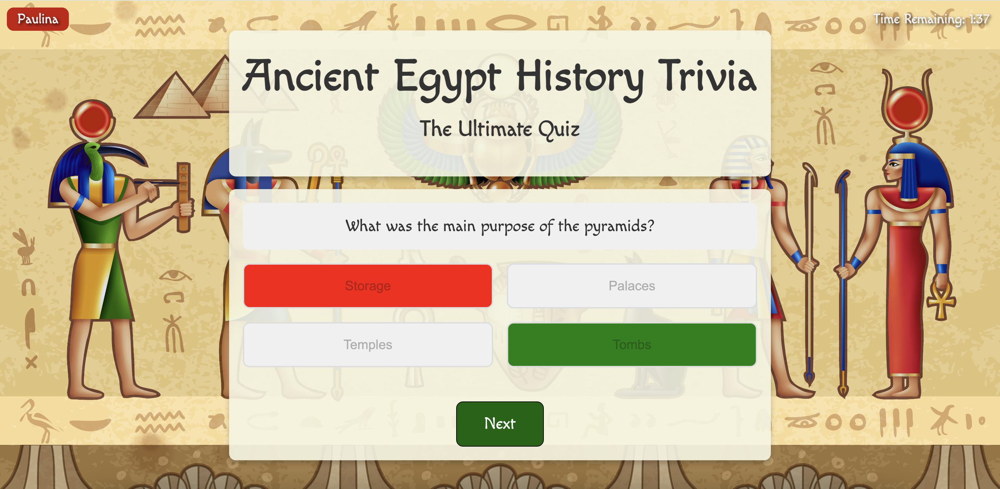
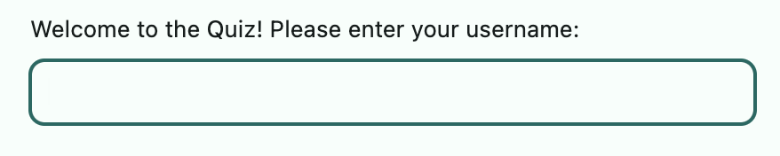
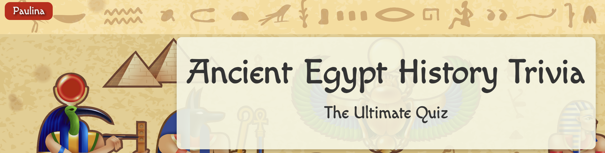
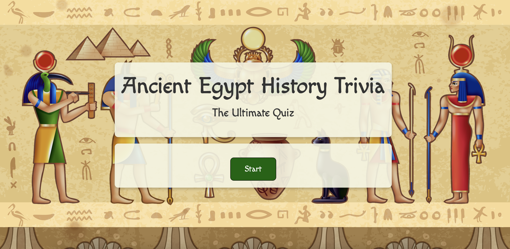
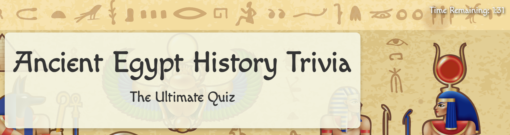
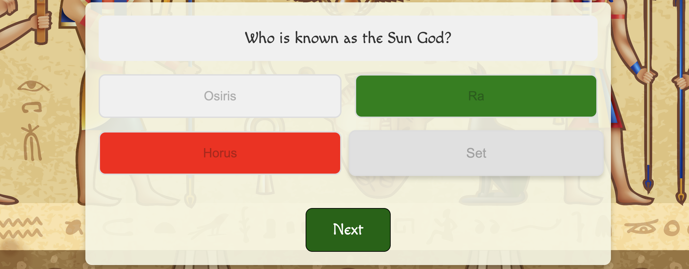
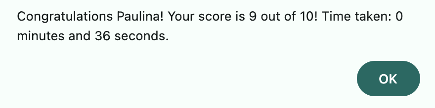
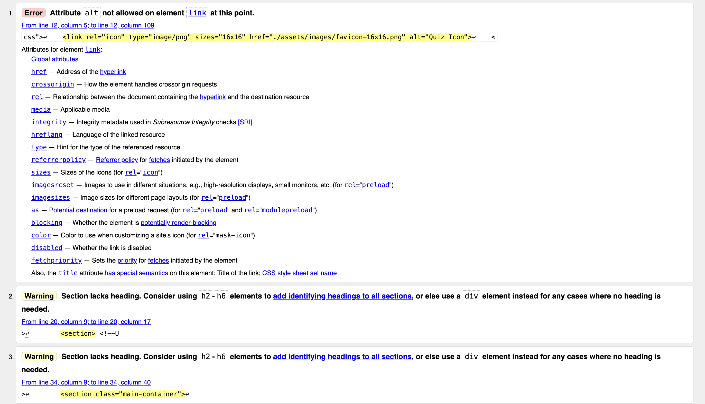
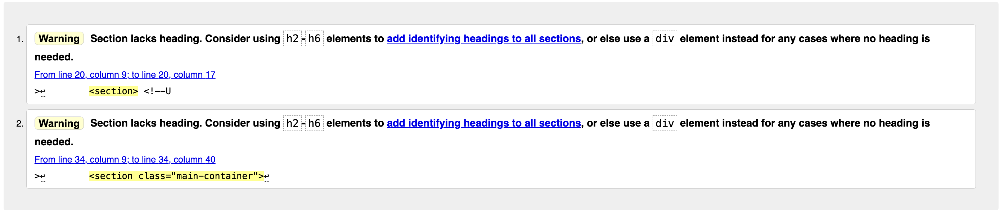
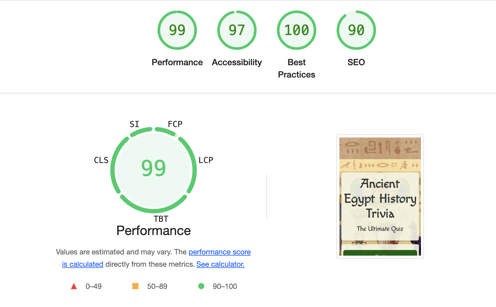

# Ancient Egypt Trivia Quiz: A Web-Based Interactive Quiz:

## Table of Contents

1. [Overview](#overview)
2. [UX Goals](#ux-goals)
3. [Target Audience](#target-audience)
4. [Visual Design](#visual-design)
5. [Key Features](#key-features)
6. [How It Works](#how-it-works)
7. [Technology Stack](#technology-stack)
8. [Files and Structure](#files-and-structure)
9. [Testing](#testing)
10. [Deployment](#deployment)
11. [Credits](#credits)
12. [Contact](#contact)

---

## Overview

The Ancient Egypt Trivia Quiz is an interactive, web-based trivia game that allows users to test their knowledge of Ancient Egyptian history, culture, and archaeology. The quiz is designed to be both informative and fun, providing users with a set of multiple-choice questions that range from basic facts to more advanced knowledge about Ancient Egypt. The quiz is timed, adding an element of challenge, and is presented with an intuitive, visually appealing layout.

---

## UX Goals

The primary UX goals for the quiz are:

- Clear, simple, and intuitive interface: Easy navigation with clear labelling of buttons and actions.
- Engaging, fun experience: Immediate feedback and gamified elements like scoring and a countdown timer.
- Personalisation: Users are prompted for their username, and progress is tracked throughout.
- Responsive and accessible design: The quiz is minimalistic, easy to read and use on various devices, and is accessible to all users.
- Educational and reflective: Users receive feedback that helps them learn while offering opportunities to retry and improve.
- Fast performance: Smooth transitions and fast load times ensure a seamless experience.

---

## Target Audience

The target audience for Ancient Egypt Trivia Quiz is anyone wanting to test or expand their current knowledge on the history of Ancient Egypt. This includes, but is not limited to:

- **History Enthusiasts**: Interested in learning and testing knowledge about Ancient Egypt.
- **Students**: Looking for an engaging way to study or reinforce classroom content.
- **Teachers and Educators**: Seeking educational tools to incorporate into their lessons.
- **Casual Gamers**: Enjoy competitive or educational quiz games.
- **Tourists and Travellers**: People preparing for or reflecting on a trip to Egypt.
- **Families**: Parents and children engaging in an educational and fun activity together.
- **Cultural Institutions**: Museums, exhibitions, or galleries focused on Ancient Egypt, offering the quiz as an interactive tool for visitors.
- **Social Media/Online Communities**: Sharing and competing in trivia challenges with friends and followers.

---

## Visual Design

- **Colour Palette**: Warm, earthy tones like golds, greens, and reds, with a background of soft neutrals to evoke Ancient Egypt. This palette draws inspiration from Egypt's iconic deserts and gold, featuring shades like deep yellows, browns, and sandy neutrals.
- **Typography**: Playful yet legible fonts ('Macondo' for titles and 'Lato' for text), combining thematic charm with readability.
- **Layout**: A centred, sectioned structure with a responsive design that provides an immersive and navigable quiz experience.
- **Interactivity**: Buttons with hover effects and colour feedback offer a smooth and engaging experience.
- **Background**: A subtle background image of ancient Egyptian desert and monuments is used to create an immersive atmosphere. The background is blurred and desaturated to ensure it doesn't overpower the quiz content.
- **Visual Feedback**: Immediate colour changes on correct/incorrect answers with transitions and animations like the timer countdown, making the quiz feel responsive and lively.

---

## Key Features

- **User Interface (UI)**:

  - **Username Input**: At the start of the quiz, users are prompted to input a username, which will be displayed throughout the quiz. This personalises the experience, especially when showing final results at the end.

  
  

  - **Main Quiz Layout**: The layout includes a title section, a timer, a username display, a dynamically updated question display, and multiple-choice buttons for answering.

  - **Visual Styling**: The UI is clean and minimalist, with a focus on legibility and usability. The vibrant design is inspired by Egyptian history, including the colour palette and typography. The background image draws inspiration from Egyptian landscapes to ensure the design is immersive.

  

  - **Timer**: A countdown timer runs throughout the quiz, starting from 2 minutes (120 seconds). The timer is prominently displayed, providing a sense of urgency as the user works through the questions. If time runs out before completing all the questions, the quiz automatically ends and informs the player that time is up.

  

  - **Questions & Answers**: The quiz features a variety of questions about Ancient Egyptian history, including topics like:

  - **Pharaohs** (e.g., "Who was the first pharaoh of Egypt?")
  - **Monuments** (e.g., "Which pyramid is the largest?")
  - **Mythology** (e.g., "Who is known as the Sun God?")
  - **Geography** (e.g., "What river was central to the development of Egypt?")

  Each question has four multiple-choice answer options, randomised to prevent users from memorising answer patterns. Correct answers are highlighted in green, while incorrect answers are shown in red after selection. The correct answer is revealed to the user if they make an error.

  

- **Game Flow**:

  - **Start**: The quiz begins with a prompt for the user to enter their username. Once a username is entered, the quiz UI is shown, and the timer begins.
  - **Answering Questions**: Users select an answer for each question. After answering, they click the "Next" button to proceed to the next question.
  - **Score Calculation**: The user's score is updated in real-time as they answer questions correctly. Each correct answer earns one point.
  - **Ending the Quiz**: Once all the questions are answered or the timer runs out, the quiz ends. The user is shown their score along with the time taken to complete the quiz.

  

---

## How It Works

1. **Start the Quiz**:
   - When the user clicks the "Start" button, they are prompted to enter their username. After entering a valid username, the quiz layout is revealed, the timer starts, and the first question is displayed.
2. **Answering Questions**:

   - For each question, four answer buttons are shown. The user selects one of the options. If the answer is correct, the button background turns green, and the user's score increases by 1 point. If the answer is incorrect, the background of the selected button turns red, and the correct answer is displayed in green.

3. **Next Question**:

   - After selecting an answer, the user clicks the "Next" button to proceed to the next question. The answer buttons are reset, and the next question is shown. This continues until all questions are answered or the timer runs out.

4. **End of Quiz**:
   - When the quiz ends, the user is shown a summary of their performance, including their score and the time taken to complete the quiz. The user can restart the quiz by clicking the "Restart" button, which shuffles the questions and resets the timer.

---

## Technology Stack

- **Languages**:

  - **HTML5**: The basic structure of the quiz is built using HTML5, ensuring semantic markup for accessibility and search engine optimisation.
  - **CSS3**: Styling is done using CSS3, with responsive design achieved using media queries. Custom fonts from Google Fonts are used for a more thematic experience.
  - **JavaScript**: The interactivity of the quiz, such as question display, answer selection, score tracking, and timer functionality, is powered by JavaScript.

- **Libraries**:

  - _Google Fonts_: To import the 'Macondo' font, which is prominently used throughout this project.

- **Platforms**:

  - _GitHub_: To store code remotely and for deployment.
  - _GitPod_: The chosen IDE environment.

- **Other**:
  - _Favicon Generator_: Although initially seeming unusual, the use of a funeral urn as the favicon aligns with the Ancient Egyptian theme. The urn symbolises mystery, death, the afterlife, and preservation of life in Egyptian culture, reinforcing the quiz’s educational goals.

---

## Files and Structure

- `index.html`: The main HTML file that contains the quiz structure.
- `assets/css/stylesheet.css`: The CSS file used for styling the page and the quiz elements.
- `assets/javascript/script.js`: The JavaScript file that contains the logic for running the quiz.
- `assets/images/`: Folder containing images like background and favicon.

---

## Testing

- **Validation**:

  - HTML has been validated with the W3C HTML5 Validator. There was 1 error message for HTML code to remove the "alt" tag from the favicon link. Once this was removed, the HTML validator showed there was no errors, only 2 minor warnings.
  - CSS has been validated with the W3C CSS Validator.
  - The JavaScript file has been tested on the site using the DevTools console.
  - Links checked with https://validator.w3.org/checklink (W3C Link Checker).

- **Testing Platforms**:

  - The project was mainly tested using the Chrome Browsers Dev Tools feature which displayed everything as expected, across different devices to test responsiveness.
  - Unfortunately, due to time constraints, I was not able to personally test the project across a wider range of devices. This is an area I would suggest for improvement in the future, as thorough cross-device testing would help ensure a more seamless experience for users on various platforms.
  - I was, however, able to test this project’s functionality across different browsers such as Firefox, Safari and Edge using LambdaTest. (Source: https://app.lambdatest.com/console/realtime/browser/desktop.) This test confirmed the successful functionality of this project across all these browsers with no bugs or compromises in fast performance.

- **Accessability**:

Using Chrome DevTools' Lighthouse tool, the website received strong performance ratings across multiple categories. The overall performance score is an impressive 99, indicating fast load times and excellent optimization. The accessibility score of 97 highlights the website's ease of use for a wide range of users, ensuring a smooth and intuitive experience. The SEO score of 90 reflects good search engine optimization practices, making the site well-indexed and discoverable. Lastly, the website achieved a perfect 100 in Best Practices, confirming that it follows modern web standards and prioritizes security and reliability. This was tested for mobile and desktop application and both had the same result. Overall, this project scored highly in the metrics indicating a well-rounded, functional, and performemce website created with usability and optimisation in mind. To further measure the accuracy of these metrics, in the future, I also plan to use additional third-party accessibility auditors such as axe and WAVE. These tools provide valuable cross-references, offering different perspectives and ensuring that the accessibility and performance data is consistent across various platforms.

---

## Deployment

This project was deployed via GitHub. Follow the steps below to deploy:

1. Log in to your GitHub account and navigate to [GitHub Repository](https://github.com/PaulinaD-CodeIns/ancient-egypt-trivia-project).
2. Fork or clone the repository.
3. Push to a new repository using `git add`, `git commit`, and `git push`.
4. Go to Settings > GitHub Pages and select the "Master" branch as the source.
5. Wait a few moments for the site to go live. View the live version [here](https://paulinad-codeins.github.io/ancient-egypt-trivia-project/).

_(Note: Not my own content, please see credits)_

## Credits

1. **Content Generator:** The questions and answer content for the Ancient Egypt Trivia Quiz was generated using ChatGPT 4.0. This AI-assisted content generation ensured the quiz covered a wide range of topics, including history, mythology, monuments, and geography. Source: https://chatgpt.com/

2. **Background Image:**The background image used in the quiz was sourced from Freepik, capturing the essence of Egyptian monuments and landscapes. Source: https://www.freepik.com/free-photos-vectors/ancient-egypt

3. **Tutorial:** The overall structure and framework of the quiz project were inspired by a tutorial from Web Dev Simplified. This resource provided the foundational logic for creating an interactive quiz using HTML, CSS, and JavaScript. Source: https://www.youtube.com/watch?v=riDzcEQbX6k&t=908s

4. **README.md Structure:** The structure of this README document follows a model example shared by my mentor. The instructions for GitHub deployment are directly referenced from this source. Source:https://github.com/Ri-Dearg/horizon-photo/blob/main/README.md#mobile-testing.

---

## Contact

Feel free to fork the repository, make changes, and submit pull requests. Suggestions for improvements are welcome!

For more information, contact me at: [paulid4628@gmail.com](mailto:paulid4628@gmail.com)
